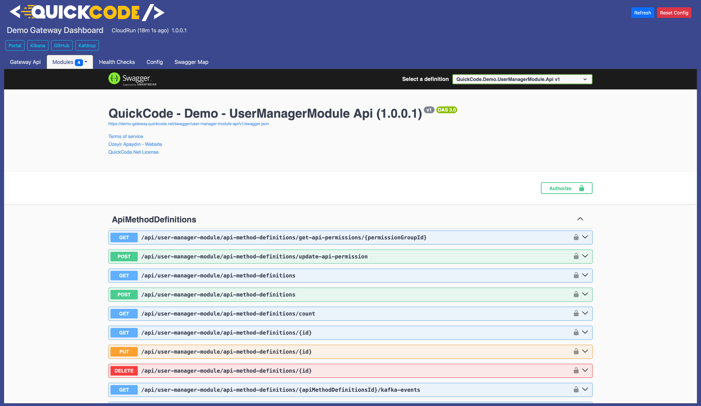
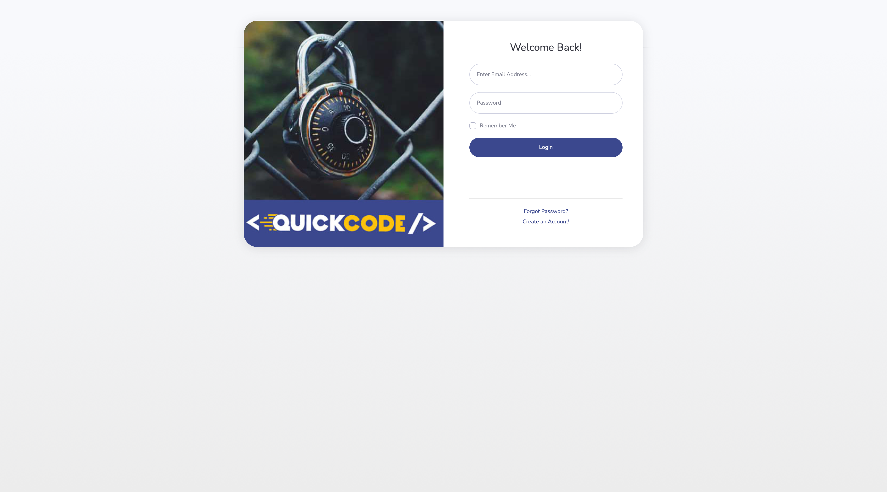
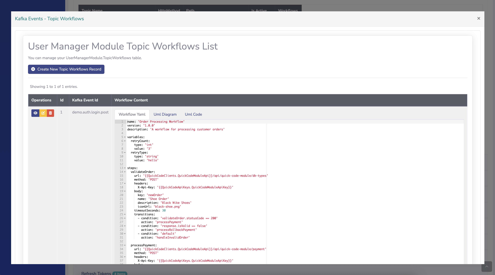
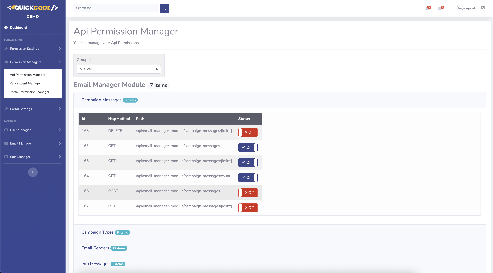
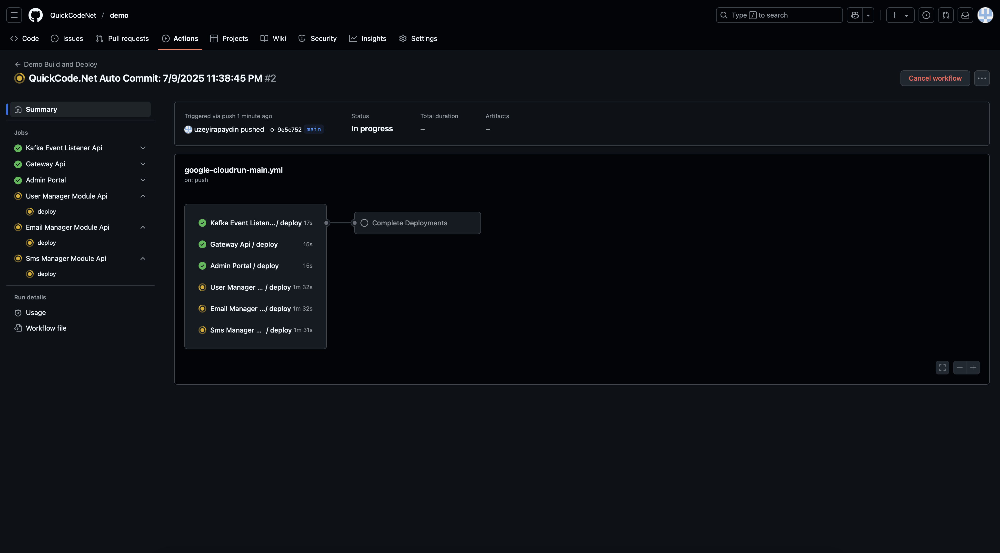

# 🚀 MyecommerceMyecommerceDemo Generated Microservice Platform

> **Ready-to-Deploy Microservices**  
> *Generated with [QuickCode.Net](https://quickcode.net) • Deployed on Google Cloud Run • CI/CD with GitHub Actions • Containerized with Docker • Event-driven with Kafka • Monitored with Elasticsearch & Kibana*

> **Design, Visualize, Code, Deploy**

[](https://dotnet.microsoft.com/)
[](https://www.docker.com/)
[](https://github.com/features/actions)
[](https://cloud.google.com/run)
[](https://www.postgresql.org/)
[](https://www.microsoft.com/sql-server)
[](https://www.mysql.com/)
[](https://kafka.apache.org/)
[](https://www.elastic.co/elasticsearch)
[](https://www.elastic.co/kibana)
[](https://docs.microsoft.com/ef/)
[](https://docs.microsoft.com/azure/architecture/patterns/cqrs)
[](LICENSE)
## Table of Contents

- [Onboarding Checklist](#onboarding-checklist)

1. [About the Solution](#about-the-solution)
2. [Technologies & Stack](#technologies--stack)
3. [Solution & Module Structure](#solution--module-structure)
    - [3.1. Solution Overview & Architecture Diagram](#31-solution-overview--architecture-diagram)
    - [3.2. Module Descriptions](#32-module-descriptions)
    - [3.3. Gateway & Portal Dashboards](#33-gateway--portal-dashboards)
    - [3.4. Domain & Routing](#34-domain--routing)
    - [3.5. Advanced Features](#35-advanced-features)
        - [Gateway API Monitoring & Kafka Integration](#gateway-api-monitoring--kafka-integration)
        - [Custom Workflows with YAML Configuration](#custom-workflows-with-yaml-configuration)
        - [User Group-Based Api Management](#user-group-based-api-management)
        - [Management Screens](#management-screens)
4. [Setup & Run](#setup--run)
    - [4.1. Running with Docker](#41-running-with-docker)
    - [4.2. Local Development](#42-local-development)
    - [4.3. CLI Tool](#43-cli-tool)
5. [Running Tests](#running-tests)
6. [CI/CD & Cloud Run Deployment](#cicd--cloud-run-deployment)
7. [Developer Notes & Extras](#developer-notes--extras)
    - [7.1. Environment Variables & Secrets](#71-environment-variables--secrets)
    - [7.2. Code Quality & Standards](#72-code-quality--standards)
    - [7.3. Contributing](#73-contributing)
8. [FAQ](#8-faq)
    - [How do I add a new module?](#how-do-i-add-a-new-module)
    - [How do I update secrets?](#how-do-i-update-secrets)
    - [How do I troubleshoot a failing service?](#how-do-i-troubleshoot-a-failing-service)
9. [Contact](#9-contact)

---

## 🚀 Onboarding Checklist

### 1. Install Prerequisites
- [ ] **Docker Desktop** (or Docker Engine) is installed and running  
  [Download Docker Desktop](https://www.docker.com/products/docker-desktop/)
- [ ] **.NET 10 SDK** is installed  
  [Download .NET 10 SDK](https://dotnet.microsoft.com/en-us/download/dotnet/9.0)
- [ ] **Git** is installed  
  [Download Git](https://git-scm.com/downloads)

### 2. Clone the Repository
- [ ] Open a terminal and run:
  ```bash
  git clone https://github.com/QuickCodeNet/myecommercedemo.git
  ```

  ```bash
  cd myecommercedemo
  ```

### 3. Configure Environment Variables
- [ ] If required, copy `.env.example` to `.env` and fill in any necessary secrets or API keys  
  (If `.env.example` does not exist, check the README or ask the project owner for required environment variables.)

### 4. Build and Start the Project
- [ ] Start all services with Docker:
    - On **macOS/Linux**:
      ```bash
      docker compose up --build
      ```
    - On **Windows**:
      ```bash
      docker-compose up --build
      ```
- [ ] Wait until all containers are up and healthy (check terminal output for errors).

### 5. Access the Application
- [ ] Open your browser and go to:
    - **Portal:** [http://localhost:6020](http://localhost:6020)
    - **Gateway:** [http://localhost:6060](http://localhost:6060)
- [ ] Log in to the Portal using demo credentials (if provided):
    - **Username:** demo@quickcode.net
    - **Password:** String1!

### 6. Run Tests and Check Code Coverage
- [ ] In a new terminal, run all tests:
  ```bash
  dotnet test QuickCode.MyecommerceDemo.Docker.sln
  ```
- [ ] Generate a code coverage report:
  ```bash
  ./run-coverage-report.sh
  ```
- [ ] Open `coverage-report/index.html` in your browser to review the results.

### 7. Explore the System
- [ ] Visit the **Gateway Dashboard** and check available modules and health checks.
- [ ] In the **Portal**, try user, role, permission, and workflow management features.
- [ ] Review logs and monitoring dashboards (Kibana, Elastic) if available.

### 8. Development Workflow
- [ ] Create a new branch for your feature or bugfix:
  ```bash
  git checkout -b feature/my-feature
  ```
- [ ] Make your changes, commit, and push:
  ```bash
  git add .
  git commit -m "Describe your changes"
  git push origin feature/my-feature
  ```
- [ ] Open a Pull Request on GitHub.

### 9. CI/CD and Deployment
- [ ] Check GitHub Actions for automated build and deployment status.
- [ ] Review Cloud Run deployment logs if you have access.


---

## 1. About the Solution

**MyecommerceDemo** is a modular, enterprise-grade .NET solution generated by [quickcode.net](https://quickcode.net).  
It is designed for scalable, maintainable, and testable microservice architectures, supporting Docker, CI/CD, and Google Cloud Run deployment.

---

## 2. Technologies & Stack

- **.NET 10** (C#)
- **Entity Framework Core**
- **PostgreSQL / SQL Server / MySQL Support**
- **Docker & Docker Compose**
- **Google Cloud Run**
- **GitHub Actions (CI/CD)**
- **Custom mediator for CQRS**
- **Swagger/OpenAPI**
- **Serilog, HealthChecks, etc.**

---

## 3. Solution & Module Structure

### 3.1. Solution Overview & Architecture Diagram

```
myecommercedemo/
  src/
    Common/
    Modules/
      .../  
      other modules
      .../ 
      IdentityModule/
    Presentation/
      QuickCode.MyecommerceDemo.Gateway/
      QuickCode.MyecommerceDemo.Portal/
    Services/
    ...
  docker-compose.yml
  README.md
```
- Architecture Diagram:
  

### 3.2. Module Descriptions

- **IdentityModule:** User, role, and permission management.
- **Gateway:** API gateway and reverse proxy.
- **Portal:** Web frontend (MVC/Razor).

### 3.3. Gateway & Portal Dashboards

QuickCode projects include ready-to-use management dashboards for both Gateway and Portal:

- **Gateway Dashboard:**
    - Central entry point for all APIs and modules
    - Health checks, Swagger Map, config management, and quick links to Portal, Kibana, Kafdrop, and GitHub
    - Your project: e.g. [https://myecommercedemo-gateway.quickcode.net](https://myecommercedemo-gateway.quickcode.net)
      

- **Portal Dashboard:**
    - Admin interface for managing all tables, users, roles, permissions, and workflows
    - Secure login, user management, and event/workflow configuration
    - Demo user credentials:
        - Username : demo@quickcode.net
        - Password : String1!
    - Your project: e.g. [https://myecommercedemo-portal.quickcode.net](https://myecommercedemo-portal.quickcode.net)
      

These dashboards are automatically deployed and available for every generated project, providing a unified and professional management experience out of the box.

### 3.4. Domain & Routing

All services and modules are deployed to Google Cloud Run and exposed via user-friendly, corporate domains ending with `.quickcode.net` for a seamless and professional experience.

- **Gateway:**
    - link: [https://myecommercedemo-gateway.quickcode.net](https://myecommercedemo-gateway.quickcode.net)
- **Portal:**
    - link: [https://myecommercedemo-portal.quickcode.net](https://myecommercedemo-portal.quickcode.net)
- **Module APIs:**
    - link: [https://myecommercedemo-identity-module.quickcode.net](https://myecommercedemo-identity-module.quickcode.net)
    - etc.

#### Gateway Routing
- The Gateway automatically routes requests to the correct module API based on the path and host.
- Swagger, health check, and module API endpoints are all mapped and accessible via the Gateway domain.
- All routing and cluster configuration is managed for you; see the sample below:

```json
{
  "Routes": {
    "identity-module": {
      "Match": {
        "Hosts": ["myecommercedemo-gateway.quickcode.net"],
        "Path": "api/identity-module/{**catch-all}"
      },
      "ClusterId": "identity-module-api"
    }
  },
  "Clusters": {
    "identity-module-api": {
      "Destinations": {
        "destination1": {
          "Address": "https://myecommercedemo-identity-module.quickcode.net"
        }
      }
    }
  }
}
```

This ensures all APIs and dashboards are accessible via clean, memorable URLs, both in demo and production environments.

### 3.5. Advanced Features

#### Gateway API Monitoring & Kafka Integration

- **API Call Tracking:** Every API call passing through the Gateway is monitored and logged
- **Predefined Topics:** Kafka integration with predefined topics for different types of API calls
- **Real-time Monitoring:** Track API performance, usage patterns, and system health
- **Event Streaming:** All API events are streamed to Kafka for real-time processing

#### Custom Workflows with YAML Configuration

- **YAML-based Workflow Definition:** Create custom workflows using simple YAML configuration
- **Endpoint Integration:** Workflows can trigger API calls to any endpoint
- **Topic-based Processing:** Workflows can subscribe to Kafka topics and process events
- **Dynamic Execution:** Workflows can be modified and deployed without code changes

#### User Group-Based Api Management

- **Endpoint-Level Permissions:** Configure access control for each API endpoint based on user groups
- **Portal Page Management:** Granular control over portal pages and CRUD operations per user group
- **Dynamic Authorization:** Real-time permission updates without system restart
- **Audit Trail:** Complete logging of all permission changes and access attempts

#### Management Screens

- **Gateway Management:** Configure API routes, permissions, and monitoring settings
- **Portal Management:** Manage user groups, page access, and CRUD permissions
- **Workflow Management:** Create, edit, and monitor custom workflows
- **Kafka Topic Management:** Monitor and configure Kafka topics and event processing

These features provide enterprise-level control and monitoring capabilities, making the system suitable for large-scale deployments with complex permission requirements.

---

## 4. Setup & Run

### 4.1. Quick Start with Docker

**On macOS and Linux:**
```bash
docker compose up --build
```

**On Windows (or older Docker installations):**
```bash
docker-compose up --build
```

**Access the services:**
- **Portal:** http://localhost:6020
- **Gateway:** http://localhost:6060

> **Note:** For detailed step-by-step instructions, see the [Onboarding Checklist](#onboarding-checklist) above.

### 4.2. Local Development

- You can run individual modules locally using Visual Studio or `dotnet run`.
- Make sure required environment variables and connection strings are set (see [Environment Variables & Secrets](#71-environment-variables--secrets)).

### 4.3. CLI Tool

**QuickCode CLI** is a command-line interface that allows you to manage your projects, modules, and microservices generation directly from your terminal. It provides the same functionality as the web UI, enabling you to work entirely from the command line.

> **📖 Documentation:**  
> - **Web Guide:** [https://www.quickcode.net/Home/CliTool](https://www.quickcode.net/Home/CliTool)  
> - **GitHub Repository:** [https://github.com/QuickCodeNet/quickcode.cli](https://github.com/QuickCodeNet/quickcode.cli)

#### Installation

**macOS (Homebrew) - Recommended:**
```bash
brew tap QuickCodeNet/quickcode-cli
brew install quickcode-cli
```

> **Update to latest version:**
> ```bash
> brew update
> brew upgrade quickcode-cli
> ```

**Windows (Scoop) - Recommended:**
```bash
scoop bucket add quickcode-cli https://github.com/QuickCodeNet/quickcode-cli-bucket
scoop install quickcode-cli
```

> **Update to latest version:**
> ```bash
> scoop update
> scoop update quickcode-cli
> ```

**Manual Installation:**
1. Download the latest release from [GitHub Releases](https://github.com/QuickCodeNet/quickcode.cli/releases)
2. Extract the archive for your platform
3. Add the executable to your PATH
4. Verify installation: `quickcode --version`

#### Quick Start

Once installed, you can manage your project entirely from the command line:

```bash
# 1. Check if project exists
quickcode demo check

# 2. Create a new project (if it doesn't exist)
quickcode demo create --email demo@quickcode.net

# 3. Store project secret code (check your email for the secret code)
quickcode demo config --set secret_code=YOUR_SECRET_CODE

# 4. List modules in the project
quickcode demo modules

# 5. Add a new module
quickcode demo modules add --module-name MyModule
# Or with all parameters:
quickcode demo modules add --module-name MyModule \
  --template-key Identity \
  --db-type mssql \
  --pattern Service

# 6. Download and edit DBML files
quickcode demo get-dbmls

# 7. Upload DBML changes
quickcode demo update-dbmls

# 8. Generate microservices (watches progress in real-time)
quickcode demo generate

# 9. Clone the generated project
quickcode demo pull
```

#### Key Features

- **Project Management:** Create, check, and manage projects
- **Module Management:** Add, remove, and list modules with various templates and patterns
- **DBML Workflow:** Download, edit, and upload DBML files for schema changes
- **Code Generation:** Trigger generation and watch progress in real-time via SignalR
- **Git Integration:** Clone and push changes to GitHub repositories
- **Security:** Encrypted secret storage with AES-256 encryption

#### Common Commands

| Command | Description | Example |
|---------|-------------|---------|
| `project create` | Create project / trigger secret e-mail | `quickcode project create --name demo` |
| `project check` | Check if project exists | `quickcode project check --name demo` |
| `project forgot-secret` | Send secret reminder email | `quickcode demo forgot-secret` |
| `project verify-secret` | Validate email + secret combination | `quickcode demo verify-secret` |
| `project get-dbmls` | Download project modules and templates | `quickcode demo get-dbmls` |
| `project update-dbmls` | Upload DBML files to API | `quickcode demo update-dbmls` |
| `module available` | List available module templates | `quickcode module available` |
| `project modules` | List modules in project | `quickcode demo modules` |
| `project modules add` | Add a new module to project.<br>**Options:**<br>• `--module-name` (required)<br>• `--template-key` (default: Empty)<br>• `--db-type` (default: mssql, values: mssql, mysql, postgresql)<br>• `--pattern` (default: Service, values: Service, CqrsAndMediator) | `quickcode demo modules add --module-name MyModule` |
| `project modules remove` | Remove module from project | `quickcode demo modules remove --module-name MyModule` |
| `project generate [--watch]` | Trigger generation and watch progress | `quickcode demo generate` |
| `project pull` | Clone or pull project from GitHub | `quickcode demo pull` |
| `project push` | Push changes to GitHub | `quickcode demo push` |

#### Security Features

- **Encrypted Secrets:** Secret codes are automatically encrypted using **AES-256 encryption** before being stored
- **Encryption Key:** Stored at `~/.quickcode/.key` with restricted file permissions (600 on Unix/macOS)
- **Automatic Migration:** Existing plain-text secrets are automatically encrypted on first load
- **Protected Display:** Secret codes are never displayed in plain text; they appear as `********` when viewing config

#### Configuration

- Config file is stored at `~/.quickcode/config.json`
- Each project must store its own `email` and `secret_code` via `config --project <name>`
- API endpoint defaults to `https://api.quickcode.net/`
- Use `config validate` to check all projects or `project validate --name <project>` for a specific project

For complete documentation and all available commands, visit:
- **Web Guide:** [https://www.quickcode.net/Home/CliTool](https://www.quickcode.net/Home/CliTool)
- **GitHub Repository:** [https://github.com/QuickCodeNet/quickcode.cli](https://github.com/QuickCodeNet/quickcode.cli)

---

## 5. Running Tests

- **Unit & Integration Tests:**
  ```bash
  dotnet test QuickCode.MyecommerceDemo.docker.sln
  ```
- **Code Coverage:**
  ```bash
  ./run-coverage-report.sh
  ```
  Coverage reports are generated in the `coverage-report/` directory.

  **Note:** The coverage script:
    - Excludes DTOs from coverage (`[*.Dtos]*`)
    - Excludes Common, Portal, and Gateway projects from coverage
    - Generates HTML reports in `coverage-report/index.html`

---

## API Testing with Postman Collections

Ready-to-use Postman collections are provided for all modules in this project. This enables you to quickly test and explore every API endpoint.

### How to Use

1. **Import All Collections:**
    - In Postman, click **Import** and select all JSON files from the `src/postman_files` directory.
    - You will see collections for the **User Manager API** and other modules (such as Email Manager Module, Sms Manager Module , etc.).

2. **Authentication Flow:**
    - Each collection contains an **Authentication** folder with a `Login` request.
    - Run the `Login` request first.
        - The test script in this request will automatically save the `access_token` (or `token`) to your Postman environment.

3. **Environment Setup:**
    - Make sure you have a Postman environment with a `token` variable (it will be set automatically after login).
    - Optionally, set a `baseUrl` variable if your API base URL is different from the default.

4. **Test Any Endpoint:**
    - After logging in, you can immediately test any endpoint in any collection.
    - All requests use the token automatically via the `Authorization: Bearer {{token}}` header.

---

### Example Workflow

1. **Import all collections from `src/postman_files`.**
2. **Select or create a Postman environment.**
3. **Run the `Login` request in the `Authentication` folder of the User Manager API or any other module.**
4. **The token is saved to the environment.**
5. **You can now use all other endpoints in all collections without manually copying tokens.**

---

### Notes

- All collections are automatically generated from the latest Swagger/OpenAPI definitions, ensuring they are always up to date.
- If your token expires or you get a 401 error, simply re-run the `login` request to refresh your token.

---

**This setup makes onboarding, testing, and integration with your APIs fast and reliable for all developers and partners.**

---

## 6. CI/CD & Cloud Run Deployment

- **GitHub Actions** is used for CI/CD.
- On every push or pull request, tests and builds are run automatically.
- On merge to `main`, Docker images are built and pushed to Google Container Registry.
- **Automatic deployment to Google Cloud Run** is triggered after a successful build.
- All secrets and environment variables are managed via **GitHub Secrets** and **GCP environment variables**.
  

**Example Workflow:**
1. Developer pushes code to GitHub.
2. GitHub Actions runs tests, builds, and coverage.
3. If on `main`, Docker images are built and pushed.
4. Cloud Run is updated with the new image.
5. Health checks and notifications are performed.

---

## 7. Developer Notes & Extras

### 7.1. Environment Variables & Secrets

- All sensitive data (connection strings, API keys) are managed via environment variables.
- **Never commit secrets to the repository.**
- For local development, use a `.env` file (excluded from git).

### 7.2. Code Quality & Standards

- Follows Clean Architecture and SOLID principles.
- Uses CQRS, repository, and dependency injection patterns.
- Linting, analyzers, and code coverage are integrated.

### 7.3. Contributing

- Fork the repository and create a feature branch.
- Write tests for your changes.
- Open a pull request with a clear description.

---

## 8. FAQ

**Q:** How do I add a new module?  
**A:** You can add a new module in two ways:
  1. **Via Web UI:** Go to [quickcode.net](https://quickcode.net), enter your project secret, and regenerate your project.
  2. **Via CLI Tool:** Use `quickcode <project> modules add --module-name MyModule` (see [CLI Tool](#43-cli-tool) section for details).

**Q:** How do I use the CLI Tool?  
**A:** Install QuickCode CLI using Homebrew (macOS) or Scoop (Windows), then follow the [CLI Tool](#43-cli-tool) section. For complete documentation, visit [https://www.quickcode.net/Home/CliTool](https://www.quickcode.net/Home/CliTool) or the [GitHub repository](https://github.com/QuickCodeNet/quickcode.cli).

**Q:** How do I update secrets?  
**A:** If you are the project owner on GitHub, you can add secrets there. Otherwise, all secrets are managed by quickcode.net. You can also use the CLI Tool to manage project secrets: `quickcode <project> config --set secret_code=YOUR_SECRET_CODE`.

**Q:** How do I troubleshoot a failing service?  
**A:** Check logs with `docker-compose logs <service>`, and review health check endpoints.

---

## 9. Contact

**Project Owner:** Üzeyir Apaydın
- LinkedIn: [linkedin.com/in/uzeyirapaydin](https://linkedin.com/in/uzeyirapaydin)
- GitHub: [github.com/uzeyirapaydin](https://github.com/uzeyirapaydin) or [github.com/QuickCodeNet](https://github.com/QuickCodeNet)
- Email: uzeyir@quickcode.net

For enterprise solutions, collaboration, or technical discussions, please reach out.

---


**Feel free to reach out or open an issue for further questions!**

**Last generation Time**: [Generated on: LAST_GENERATION_TIME_UTC UTC]